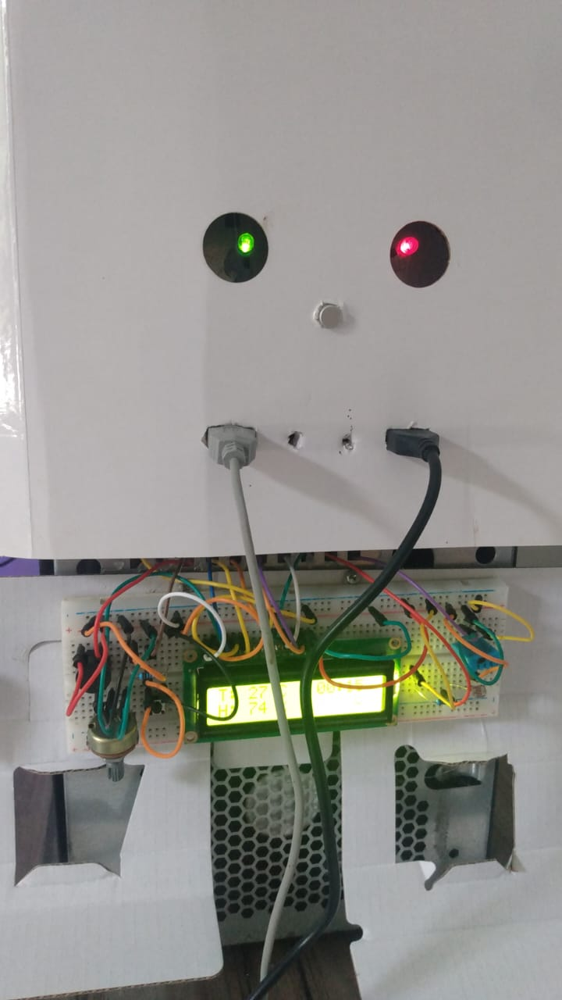
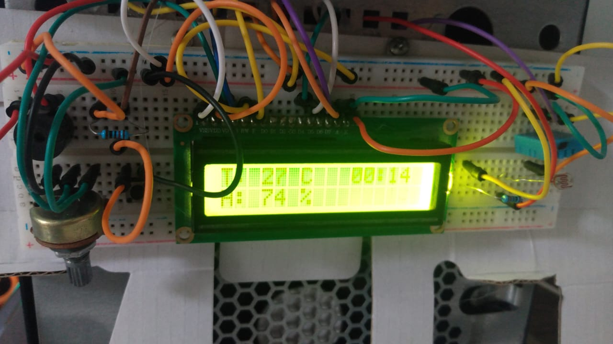

# Bem-vindo ao Roberto! 

# Introdução
Este é o guia para congiguração iot pc "Roberto", aqui tem as configurações e como o sistema está funcionando

## Tecnologias Utilizadas
* Go
* C++
* Arduino

## Screenshots
| dash |
| --- |
|  |

 

| frente |
| --- |
|  |

 

| painel |
| --- |
|  |

 

