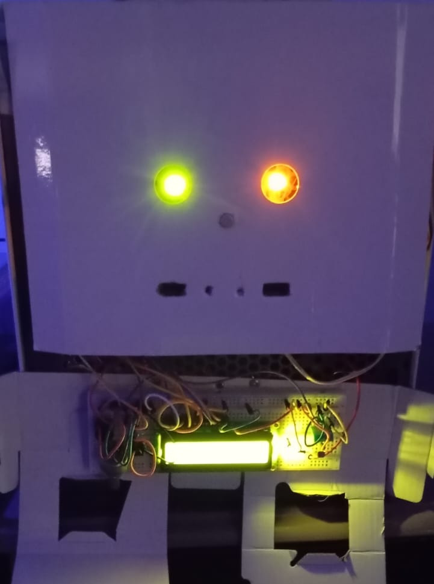
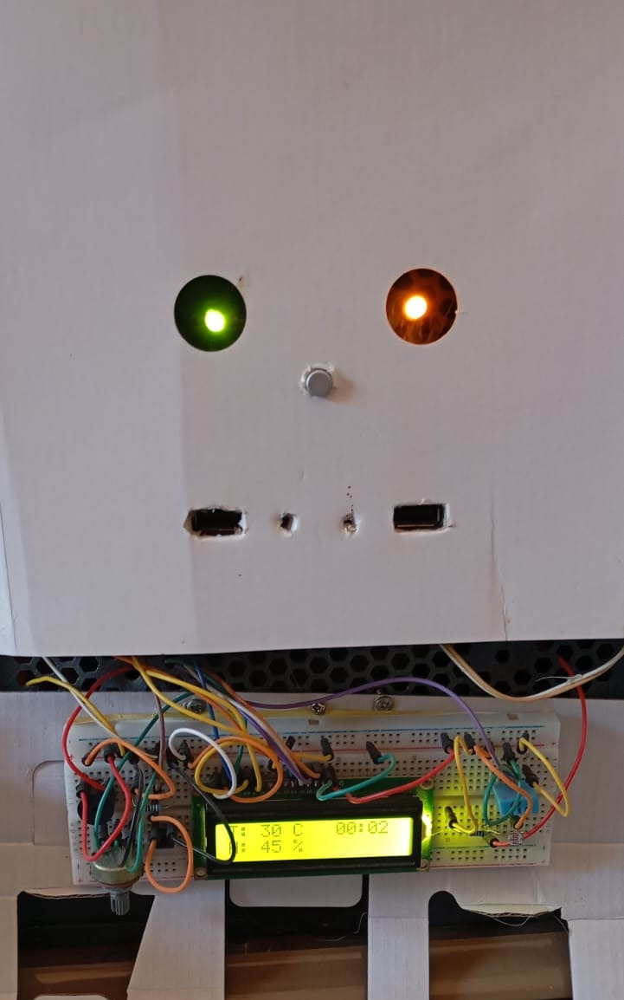
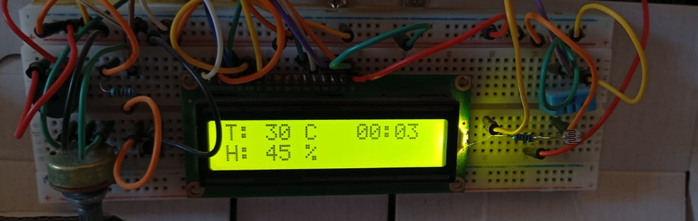

# Roberto

## Descrição

Roberto é o meu PC pessoal, no qual desenvolvi um sistema automatizado utilizando Arduino e ESP32. Este sistema inclui um painel de controle com vários sensores, que posso controlar manualmente pelo painel ou através de uma API que desenvolvi usando Go

## Stacks

- Go
- C++
- Arduino
- Esp32

## Funcionalidades
- Painel de monitoramento
- Api de controle
- Tela com informações do clima
- Verificação de claridada
- Tocar musicas
- Liga leds do computador se estiver escuro

## Imagens

| Frente Noite |  Frente Dia |
| --- | --- |
|  |  |

| Painel de controle 
| --- | 
| 
